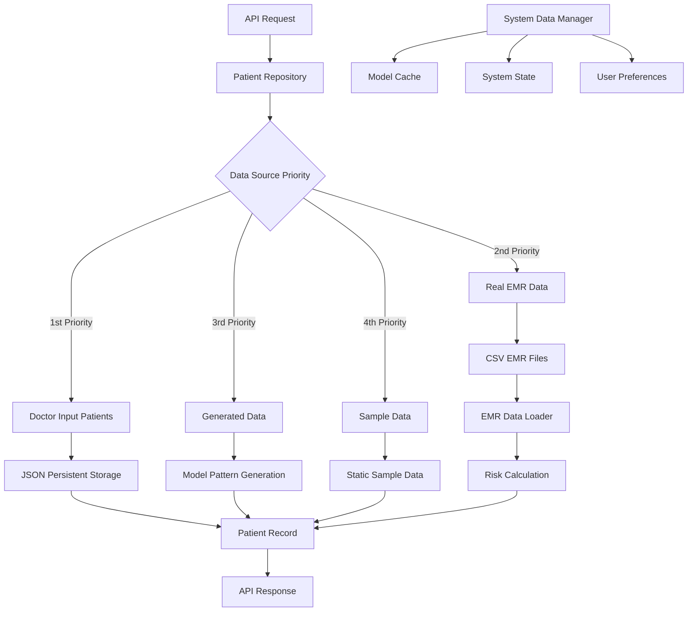

# Data Access Module Guide

## Overview

The `backend/data_access` module is responsible for managing data access across the EMR Alert System. It provides a unified interface for accessing patient data from multiple sources, managing system state, and handling persistent storage.

## Architecture

```
backend/data_access/
├── emr_data_loader.py      # EMR data integration and loading
├── patient_repository.py   # Patient data repository with multiple sources
├── system_data_manager.py  # System state and configuration management
└── DATA_ACCESS_GUIDE.md    # This guide
```

## Components

### 1. EMR Data Loader (`emr_data_loader.py`)

**Purpose**: Integrates with actual EMR data sources and loads real patient data for analysis.

#### Key Features
- Loads patient data from CSV files (processed EMR data)
- Filters patients with Disease X indicators
- Calculates risk levels and alert status
- Provides patient statistics and demographics

#### Main Classes
- `EMRDataLoader`: Main class for loading EMR data

#### Key Methods
```python
# Load real patient data from EMR sources
load_real_patients(max_patients: int = 100) -> List[Dict[str, Any]]

# Get patient statistics
get_patient_statistics() -> Dict[str, Any]

# Filter patients with Disease X indicators
_filter_disease_x_patients(transactions_df, max_patients) -> pd.DataFrame

# Build comprehensive patient record
_build_patient_record(...) -> Dict[str, Any]
```

#### Data Sources
- `data/processed/dim_patient_cleaned.csv` - Patient demographics
- `data/processed/dim_physician_cleaned.csv` - Physician information
- `data/processed/fact_txn_cleaned.csv` - Transaction/fact data

#### Risk Calculation
The system calculates risk levels based on:
- **Age factor**: 65+ (3 points), 45-64 (2 points), <45 (1 point)
- **Comorbidity factor**: Number of comorbidities (up to 3 points)
- **Symptom factor**: Number of symptoms (up to 2 points)

Risk levels:
- High Risk: 6+ points
- Medium Risk: 4-5 points
- Low Risk: <4 points

### 2. Patient Repository (`patient_repository.py`)

**Purpose**: Central repository for patient data from multiple sources with priority-based data access.

#### Key Features
- Multi-source data integration (Doctor input, EMR data, Generated data)
- Persistent storage with JSON format
- Patient creation from doctor input
- Caching mechanism for performance

#### Main Classes
- `PatientRepository`: Main repository class

#### Data Priority Order
1. **Doctor Input Patients** (from UI) - Highest priority
2. **Real EMR Data** - When available
3. **Generated Data** - Based on model patterns
4. **Sample Data** - For demonstration

#### Key Methods
```python
# Get all patients with caching
get_patients(use_cache: bool = True) -> List[Dict[str, Any]]

# Get specific patient by ID
get_patient_by_id(patient_id: int) -> Dict[str, Any]

# Create patient from doctor input
create_patient_from_input(patient_input) -> Dict[str, Any]

# Add/update patient data
add_patient(patient_data: Dict[str, Any]) -> bool
update_patient(patient_id: int, updates: Dict[str, Any]) -> bool
```

#### Persistent Storage
- **Location**: `data/storage/patients/doctor_input_patients.json`
- **Format**: JSON with metadata and patient records
- **Features**: Version tracking, timestamps, data source tracking

#### Patient Record Structure
```json
{
  "id": 1001,
  "name": "John Smith",
  "age": 59,
  "gender": "Male",
  "diagnosisDate": "2024-01-15",
  "hasDiseaseX": true,
  "riskLevel": "High Risk",
  "hasAlert": true,
  "comorbidities": ["Heart Disease", "Diabetes"],
  "symptoms": ["Cough", "Fever", "Shortness of Breath"],
  "physician": {
    "id": 12345,
    "specialty": "Emergency Medicine",
    "experience": "15 years"
  },
  "dataSource": "Doctor Input",
  "riskScore": 8,
  "createdAt": "2024-01-15T10:30:00",
  "lastUpdated": "2024-01-15T10:30:00"
}
```

### 3. System Data Manager (`system_data_manager.py`)

**Purpose**: Manages system-level persistent data including configuration, state, and user preferences.

#### Key Features
- Model cache management
- System state tracking
- User preferences storage
- Performance metrics collection

#### Main Classes
- `SystemDataManager`: Main system data management class

#### Key Methods
```python
# Model cache management
load_model_cache() -> Dict[str, Any]
save_model_cache(data: Dict[str, Any]) -> bool

# System state management
load_system_state() -> Dict[str, Any]
save_system_state(data: Dict[str, Any]) -> bool

# User preferences management
load_user_preferences() -> Dict[str, Any]
save_user_preferences(data: Dict[str, Any]) -> bool

# Status updates
update_model_status(is_loaded: bool, model_path: str = None, error: str = None) -> bool
update_system_metrics(metrics: Dict[str, Any]) -> bool
```

#### Data Files
- `data/storage/system/model_cache.json` - Model loading and performance data
- `data/storage/system/system_state.json` - Runtime system state
- `data/storage/system/user_preferences.json` - User interface preferences

#### System State Structure
```json
{
  "metadata": {
    "version": "1.0",
    "created_at": "2024-01-15T10:30:00",
    "last_updated": "2024-01-15T10:30:00"
  },
  "system_status": {
    "api_status": "healthy",
    "model_status": "loaded",
    "database_status": "connected",
    "uptime_seconds": 3600
  },
  "performance_metrics": {
    "total_requests": 1000,
    "successful_requests": 950,
    "failed_requests": 50,
    "average_response_time_ms": 150
  },
  "feature_flags": {
    "enable_ai_analysis": true,
    "enable_patient_creation": true,
    "debug_mode": false
  }
}
```

## Usage Examples

### Loading Patient Data
```python
from backend.data_access.patient_repository import patient_repository

# Get all patients (with caching)
patients = patient_repository.get_patients()

# Get specific patient
patient = patient_repository.get_patient_by_id(1001)

# Create new patient from doctor input
new_patient = patient_repository.create_patient_from_input(patient_input)
```

### Loading EMR Data
```python
from backend.data_access.emr_data_loader import emr_data_loader

# Load real EMR patients
real_patients = emr_data_loader.load_real_patients(max_patients=100)

# Get patient statistics
stats = emr_data_loader.get_patient_statistics()
```

### System Data Management
```python
from backend.data_access.system_data_manager import system_data_manager

# Load system state
state = system_data_manager.load_system_state()

# Update model status
system_data_manager.update_model_status(is_loaded=True, model_path="/path/to/model.pkl")

# Save user preferences
preferences = system_data_manager.load_user_preferences()
preferences['ui_preferences']['theme'] = 'dark'
system_data_manager.save_user_preferences(preferences)
```

## Data Flow



## Error Handling

The module implements comprehensive error handling:

1. **File Access Errors**: Graceful fallback when data files are missing
2. **Data Format Errors**: Validation and type conversion for data integrity
3. **Cache Errors**: Fallback to direct data loading when cache fails
4. **Network Errors**: Retry mechanisms for external data sources

## Performance Considerations

1. **Caching**: 5-minute cache for patient data to reduce I/O operations
2. **Lazy Loading**: Data loaded only when needed
3. **Batch Operations**: Efficient bulk data processing
4. **Memory Management**: Proper cleanup of large datasets

## Security Considerations

1. **Data Anonymization**: Patient names are anonymized in real data
2. **Access Control**: File permissions for sensitive data
3. **Data Validation**: Input validation for all data operations
4. **Audit Logging**: Tracking of data access and modifications

## Configuration

### Environment Variables
- `DATA_DIR`: Override default data directory path
- `CACHE_DURATION`: Patient data cache duration in seconds
- `MAX_PATIENTS`: Maximum number of patients to load

### File Paths
- **Patient Data**: `data/storage/patients/`
- **System Data**: `data/storage/system/`
- **EMR Data**: `data/processed/`

## Troubleshooting

### Common Issues

1. **No Patient Data Available**
   - Check if `data/storage/patients/doctor_input_patients.json` exists
   - Verify EMR data files in `data/processed/`
   - Check file permissions

2. **Model Loading Errors**
   - Verify model files exist in `backend/ml_models/models/`
   - Check system state in `data/storage/system/system_state.json`
   - Review error logs in `logs/`

3. **Performance Issues**
   - Check cache status in system state
   - Monitor memory usage in performance metrics
   - Consider reducing `max_patients` parameter

### Debug Mode
Enable debug mode in system state to get detailed logging:
```python
system_data_manager.update_system_metrics({
    'feature_flags': {'debug_mode': True}
})
```

## Future Enhancements

1. **Database Integration**: Replace file-based storage with database
2. **Real-time Updates**: WebSocket support for live data updates
3. **Data Validation**: Enhanced schema validation
4. **Backup/Restore**: Automated backup and restore functionality
5. **API Rate Limiting**: Protection against excessive requests
6. **Data Encryption**: Encrypt sensitive patient data at rest

## Dependencies

- `pandas`: Data manipulation and analysis
- `numpy`: Numerical operations
- `pathlib`: File path operations
- `json`: JSON serialization
- `datetime`: Date/time handling
- `logging`: Logging functionality

## Testing

The module includes comprehensive error handling and logging. For testing:

1. **Unit Tests**: Test individual methods with mock data
2. **Integration Tests**: Test data flow between components
3. **Performance Tests**: Load testing with large datasets
4. **Error Tests**: Test error handling and recovery

## Contributing

When modifying this module:

1. Maintain backward compatibility with existing data formats
2. Add comprehensive error handling for new features
3. Update this guide for any architectural changes
4. Test with both real and sample data
5. Follow the existing code style and patterns
